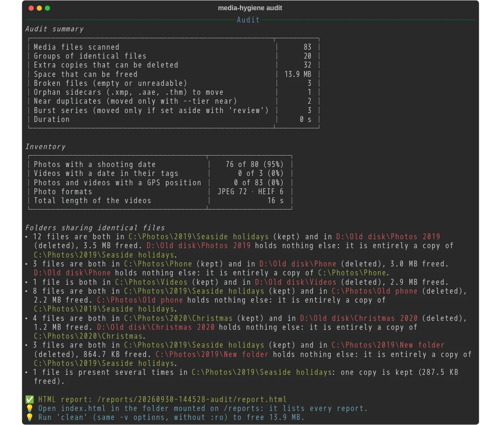

# media-hygiene

Find and safely clean duplicate photos and videos spread over several folders and disks — from
one `docker run`, on Windows (PowerShell) or WSL.

🇫🇷 [Version française](README_FR.md)



## Quick start

With Docker installed, one command audits a folder:

```powershell
docker run --rm -it -v "C:\Photos:/data/c/Photos:ro" cavo789/media-hygiene audit
```

It lists the duplicate and broken photos and videos of `C:\Photos`, and changes nothing: `:ro`
(read-only) makes Docker itself forbid any write. The first run downloads the image by itself.
[Your first audit](documentation/en/start/01-first-audit.md) explains this command and its result, part
by part.

What it does:

- **Exact duplicates** — same size and same SHA-256, compared again byte for byte right before
  any deletion. Found across folders *and* disks (`C:` and `D:` in the same run).
- **Broken files** — empty files, images and RAW files that cannot be decoded (truncated JPEG,
  …), videos that cannot be opened.
- **Reversible** — every action is journaled; `undo` restores every deleted copy from the copy
  that was kept, and every quarantined file from the quarantine.
- **Orphan sidecars** — a sidecar file (`.xmp`, `.aae`, `.thm`) left without its photo is
  moved to the quarantine; one next to its photo is never touched.
- **Burst series and near duplicates** — shown side by side in an HTML report; you choose the
  best shots of each burst [with the keyboard, in your browser](documentation/en/clean/10-review-bursts.md).
- **Never touched without your say** — bursts, near duplicates, protected folders.

## Documentation

The [documentation](documentation/en/README.md) walks you through, one step at a time. Each step
adds one thing to the command of the step before.

**Start here** — the same three first steps, whatever you do next:

1. [Your first audit](documentation/en/start/01-first-audit.md) — one folder, one command, and how to
   read the result.
2. [Keep the cache](documentation/en/start/02-keep-the-cache.md) — the next audits take seconds instead
   of minutes.
3. [Several folders and disks](documentation/en/start/03-several-folders.md) — `C:` and `D:` together,
   the current folder, WSL.

**Clean the duplicates**

4. [The HTML report](documentation/en/clean/04-html-report.md) — the pictures, the folder pairs, the
   proof.
5. [Choose which copy stays](documentation/en/clean/05-choose-the-kept-copy.md) — `--prefer`,
   `--protect`, `--exclude`.
6. [Only some file types](documentation/en/clean/06-file-types.md) — `--ext`, and files other than
   photos.
7. [The configuration file](documentation/en/clean/07-configuration-file.md) — write your choices once,
   in `config.toml`.
8. [Clean](documentation/en/clean/08-clean.md) — delete the extra copies, with a journal and a
   quarantine.
9. [Undo, history, purge](documentation/en/clean/09-undo-history-purge.md) — change your mind, see what
   was done, empty the quarantine.
10. [Sort burst series in your browser](documentation/en/clean/10-review-bursts.md) — keep the best
    shots of each burst, with the keyboard.
11. [Near duplicates](documentation/en/clean/11-near-duplicates.md) — resized and recompressed copies
    (`--tier near`).
12. [Decide pair by pair](documentation/en/clean/12-decide-pair-by-pair.md) — swap or leave alone a
    folder pair, from the report.
13. [A second opinion](documentation/en/clean/13-second-opinion.md) — compare with Czkawka, an
    independent tool.

**Sort the photos** (clean the duplicates first)

4. [Propose a tidy tree](documentation/en/sort/04-classify.md) — `classify` proposes a place
   for every file, and changes nothing.
5. [Review the proposal](documentation/en/sort/05-review-the-proposal.md) — correct it in a
   workbook, look at the photos in the report.

**Reference** — [commands and options](documentation/en/reference-commands.md),
[mount points](documentation/en/reference-mount-points.md),
[how your photos stay safe](documentation/en/reference-safety.md),
[sidecar files](documentation/en/reference-sidecars.md),
[troubleshooting](documentation/en/reference-troubleshooting.md),
[advanced usage](documentation/en/reference-advanced.md).

**For developers** — [build the image, the devcontainer, releases](documentation/en/development.md).

## The complete command

Once through the guide, most people end up with this command: two folders, the cache, the
reports, the configuration, the journal and the quarantine. It cleans; to audit, add `:ro` to
your folders and write `audit` instead of `clean`.

```powershell
mkdir "$HOME\media-hygiene\reports", "$HOME\media-hygiene\config", "$HOME\media-hygiene\journal", "$HOME\media-hygiene\quarantine"
docker run --rm -it `
  -v "C:\Photos:/data/c/Photos" `
  -v "D:\Old disk:/data/d/Old disk" `
  -v media-hygiene-cache:/cache `
  -v "$HOME\media-hygiene\reports:/reports" `
  -v "$HOME\media-hygiene\config:/config" `
  -v "$HOME\media-hygiene\journal:/journal" `
  -v "$HOME\media-hygiene\quarantine:/quarantine" `
  cavo789/media-hygiene clean
```

From WSL, write Linux paths and run as yourself, so that new files belong to you:

```bash
mkdir -p ~/media-hygiene/{reports,config,journal,quarantine}
docker run --rm -it --user "$(id -u):$(id -g)" \
  -v "/mnt/c/Photos:/data/c/Photos" \
  -v "/mnt/d/Old disk:/data/d/Old disk" \
  -v media-hygiene-cache:/cache \
  -v ~/media-hygiene/reports:/reports \
  -v ~/media-hygiene/config:/config \
  -v ~/media-hygiene/journal:/journal \
  -v ~/media-hygiene/quarantine:/quarantine \
  cavo789/media-hygiene clean
```

`undo` instead of `clean` puts everything back.

## Update

`docker pull cavo789/media-hygiene` fetches the latest version; a tag such as
`cavo789/media-hygiene:0.3.0` pins one.

### Coming from media-dedup

Up to version 0.2, the tool was called **media-dedup** (`cavo789/media-dedup`); it is
media-hygiene since version 0.3.0. Nothing of yours is lost:

- Write `cavo789/media-hygiene` instead of `cavo789/media-dedup` in your commands: the old
  image is no longer on Docker Hub (Docker then answers *pull access denied*).
- Keep your folders and volumes: `$HOME\media-dedup\journal`, `media-dedup-cache` and the
  others are yours, whatever their name. Keep writing them in your `-v` options: `undo`,
  `history` and the cache find everything they hold.
- The `MEDIA_DEDUP_…` environment variables still work until version 0.4.0, with a warning:
  rename them `MEDIA_HYGIENE_…`.
