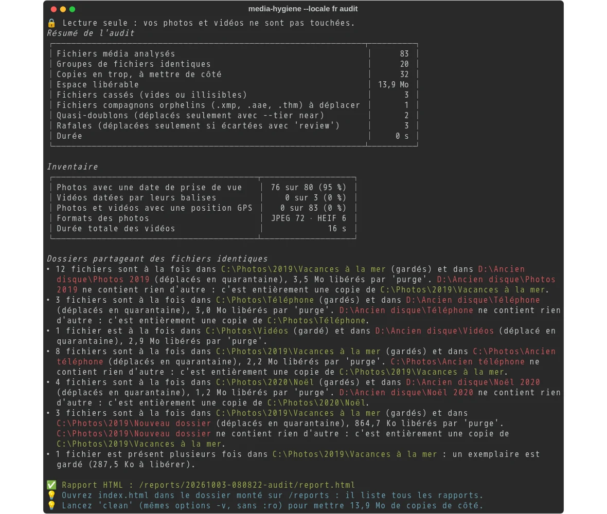

# media-hygiene

Trouve et nettoie en toute sécurité les photos et vidéos en double, réparties sur plusieurs
dossiers et plusieurs disques — d'un seul `docker run`, sous Windows (PowerShell) ou WSL.

🇬🇧 [English version](README.md)



## Démarrage rapide

Avec Docker installé, une seule commande audite un dossier :

```powershell
docker run --rm -it -v "C:\Photos:/data/c/Photos:ro" cavo789/media-hygiene --locale fr audit
```

Elle liste les photos et vidéos en double ou cassées de `C:\Photos`, sans rien modifier : `:ro`
(lecture seule) fait interdire toute écriture par Docker lui-même. Le premier lancement
télécharge l'image tout seul. [Votre premier audit](documentation/fr/01-first-audit.md) explique
cette commande et son résultat, morceau par morceau.

Ce qu'elle fait :

- **Doublons exacts** : même taille et même SHA-256, comparés à nouveau octet par octet juste
  avant toute suppression. Détectés entre dossiers *et* entre disques (`C:` et `D:` dans la même
  exécution).
- **Fichiers cassés** : fichiers vides, images et fichiers RAW impossibles à décoder (JPEG
  tronqué, …), vidéos impossibles à ouvrir.
- **Réversible** : chaque action est journalisée ; `undo` reconstruit chaque copie supprimée à
  partir de la copie conservée, et ressort chaque fichier de la quarantaine.
- **Fichiers compagnons orphelins** : un fichier compagnon (`.xmp`, `.aae`, `.thm`) resté sans
  sa photo est déplacé en quarantaine ; celui qui accompagne sa photo n'est jamais touché.
- **Rafales et quasi-doublons** : montrés côte à côte dans un rapport HTML ; vous choisissez les
  meilleures photos de chaque rafale [au clavier, dans votre navigateur](documentation/fr/10-review-bursts.md).
- **Jamais touchés sans votre accord** : les rafales, les quasi-doublons, les dossiers protégés.

## Documentation

La [documentation](documentation/fr/README.md) vous accompagne pas à pas. Chaque étape ajoute une
seule chose à la commande de l'étape précédente.

**Guide — pas à pas**

1. [Votre premier audit](documentation/fr/01-first-audit.md) : un dossier, une commande, et
   comment lire le résultat.
2. [Garder le cache](documentation/fr/02-keep-the-cache.md) : les audits suivants prennent des
   secondes au lieu de minutes.
3. [Plusieurs dossiers et disques](documentation/fr/03-several-folders.md) : `C:` et `D:`
   ensemble, le dossier courant, WSL.
4. [Le rapport HTML](documentation/fr/04-html-report.md) : les images, les paires de dossiers, la
   preuve.
5. [Choisir la copie gardée](documentation/fr/05-choose-the-kept-copy.md) : `--prefer`,
   `--protect`, `--exclude`.
6. [Seulement certains types de fichiers](documentation/fr/06-file-types.md) : `--ext`, et les
   fichiers autres que des photos.
7. [Le fichier de configuration](documentation/fr/07-configuration-file.md) : écrire vos choix une
   fois pour toutes, dans `config.toml`.
8. [Nettoyer](documentation/fr/08-clean.md) : supprimer les copies en trop, avec un journal et une
   quarantaine.
9. [Annuler, historique, purge](documentation/fr/09-undo-history-purge.md) : changer d'avis, voir
   ce qui a été fait, vider la quarantaine.
10. [Trier les rafales dans le navigateur](documentation/fr/10-review-bursts.md) : garder les
    meilleures photos de chaque rafale, au clavier.
11. [Les quasi-doublons](documentation/fr/11-near-duplicates.md) : les copies réduites et
    recompressées (`--tier near`).
12. [Décider paire par paire](documentation/fr/12-decide-pair-by-pair.md) : inverser une paire de
    dossiers ou ne pas y toucher, depuis le rapport.
13. [Un second avis](documentation/fr/13-second-opinion.md) : comparer avec Czkawka, un outil
    indépendant.

**Référence** : [commandes et options](documentation/fr/reference-commands.md),
[points de montage](documentation/fr/reference-mount-points.md),
[comment vos photos restent en sécurité](documentation/fr/reference-safety.md),
[fichiers compagnons](documentation/fr/reference-sidecars.md),
[dépannage](documentation/fr/reference-troubleshooting.md).

**Pour les développeurs** : [construire l'image, le devcontainer, les versions](documentation/fr/development.md).

## La commande complète

Une fois le guide parcouru, la plupart des gens arrivent à cette commande : deux dossiers, le
cache, les rapports, la configuration, le journal et la quarantaine. Elle nettoie ; pour un
audit, ajoutez `:ro` à vos dossiers et écrivez `audit` au lieu de `clean`.

```powershell
mkdir "$HOME\media-hygiene\reports", "$HOME\media-hygiene\config", "$HOME\media-hygiene\journal", "$HOME\media-hygiene\quarantine"
docker run --rm -it `
  -v "C:\Photos:/data/c/Photos" `
  -v "D:\Ancien disque:/data/d/Ancien disque" `
  -v media-hygiene-cache:/cache `
  -v "$HOME\media-hygiene\reports:/reports" `
  -v "$HOME\media-hygiene\config:/config" `
  -v "$HOME\media-hygiene\journal:/journal" `
  -v "$HOME\media-hygiene\quarantine:/quarantine" `
  cavo789/media-hygiene --locale fr clean
```

Depuis WSL, écrivez les chemins Linux et lancez le conteneur sous votre identité, pour que les
fichiers créés vous appartiennent :

```bash
mkdir -p ~/media-hygiene/{reports,config,journal,quarantine}
docker run --rm -it --user "$(id -u):$(id -g)" \
  -v "/mnt/c/Photos:/data/c/Photos" \
  -v "/mnt/d/Ancien disque:/data/d/Ancien disque" \
  -v media-hygiene-cache:/cache \
  -v ~/media-hygiene/reports:/reports \
  -v ~/media-hygiene/config:/config \
  -v ~/media-hygiene/journal:/journal \
  -v ~/media-hygiene/quarantine:/quarantine \
  cavo789/media-hygiene --locale fr clean
```

`undo` au lieu de `clean` remet tout en place.

## Mettre à jour

`docker pull cavo789/media-hygiene` récupère la dernière version ; un tag comme
`cavo789/media-hygiene:0.3.0` en fixe une.

### Vous veniez de media-dedup ?

Jusqu'à la version 0.2, l'outil s'appelait **media-dedup** (`cavo789/media-dedup`) ; il
s'appelle media-hygiene depuis la version 0.3.0. Rien de ce que vous avez n'est perdu :

- Écrivez `cavo789/media-hygiene` au lieu de `cavo789/media-dedup` dans vos commandes.
- Gardez vos dossiers et vos volumes : `$HOME\media-dedup\journal`, `media-dedup-cache` et
  les autres vous appartiennent, quel que soit leur nom. Continuez à les écrire dans vos
  options `-v` : `undo`, `history` et le cache y retrouvent tout.
- Les variables d'environnement `MEDIA_DEDUP_…` fonctionnent encore jusqu'à la version 0.4.0,
  avec un avertissement : renommez-les `MEDIA_HYGIENE_…`.
