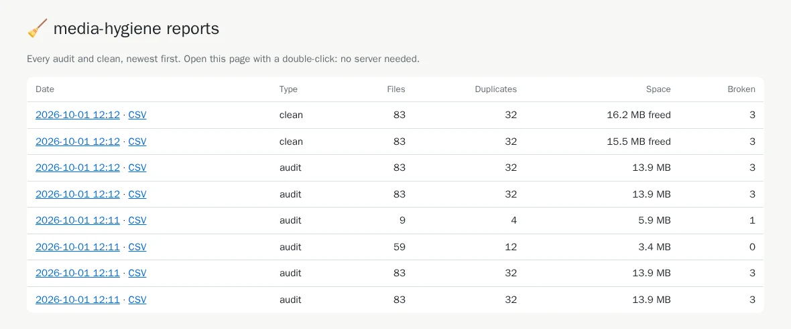
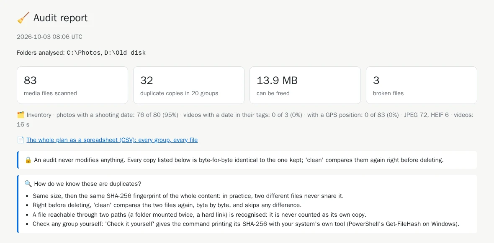
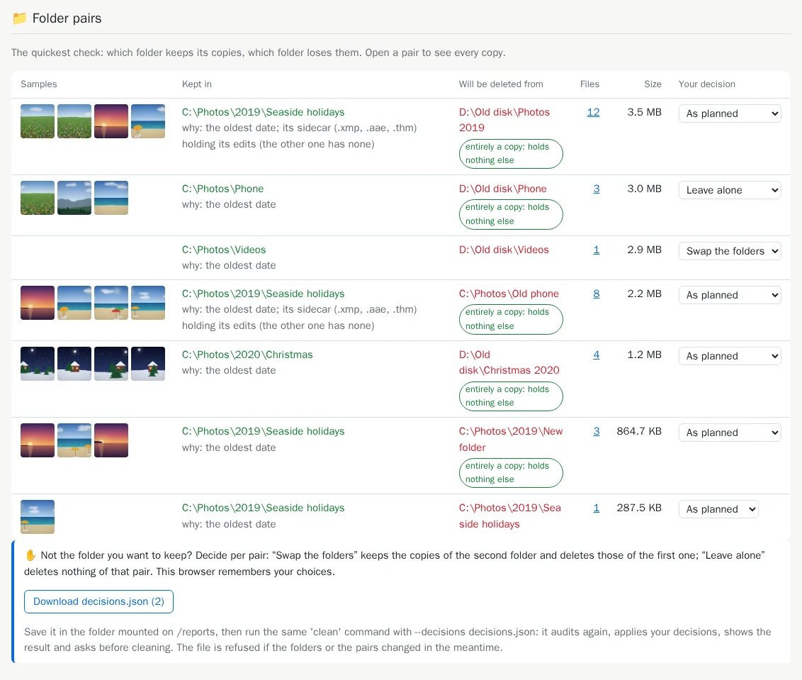
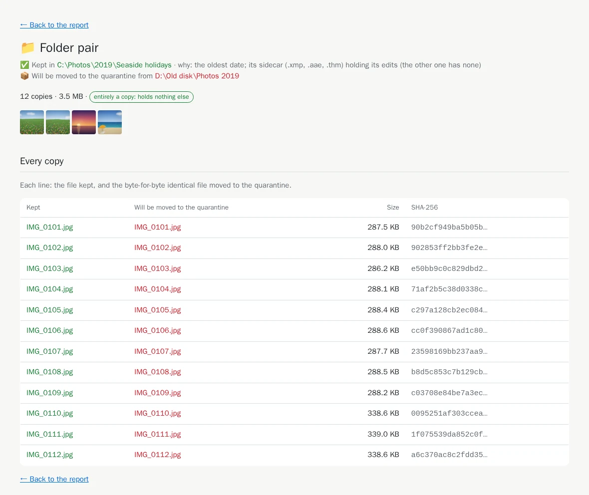
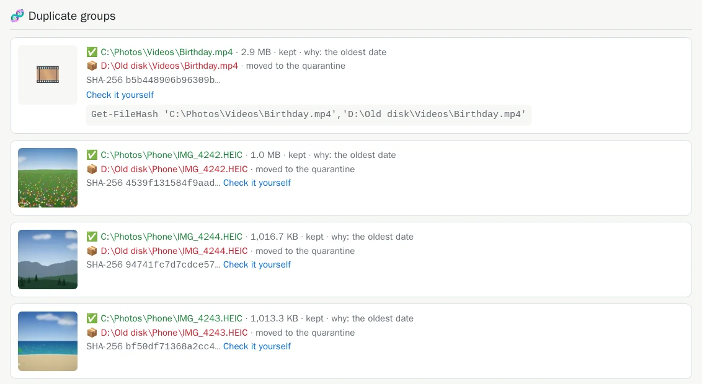
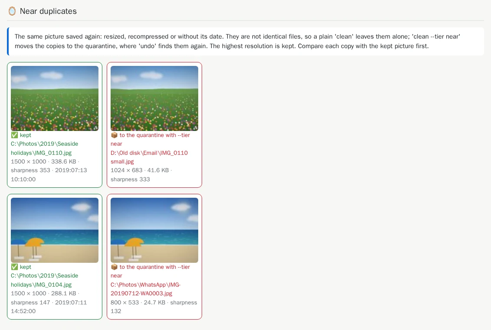
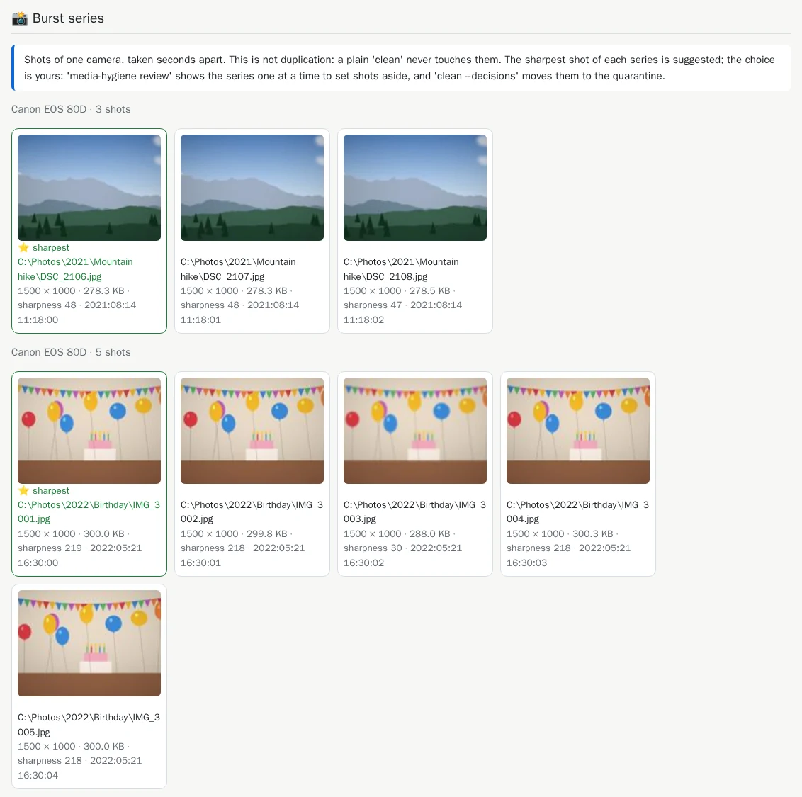
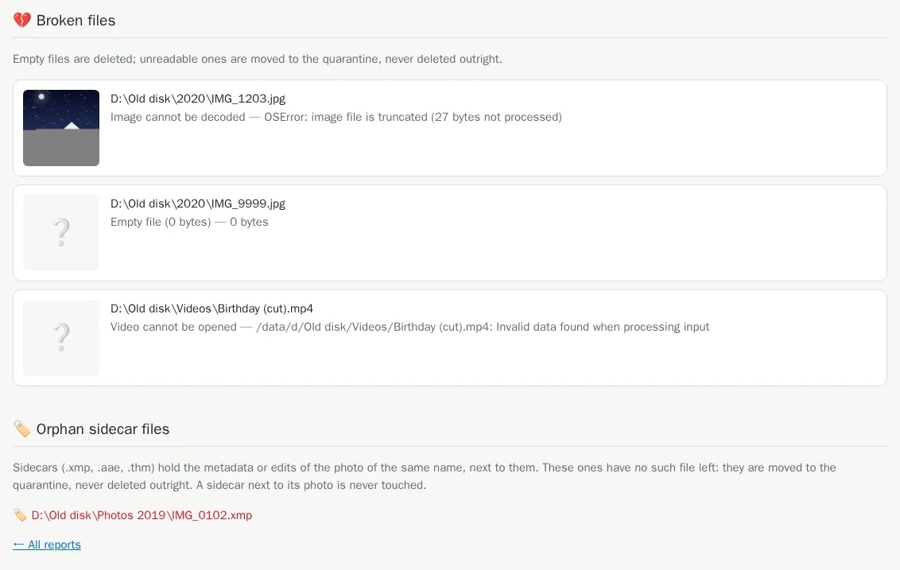

# 4. The HTML report

[Documentation](README.md) › Step 4 of 13 · 🇫🇷 [Français](../fr/04-html-report.md)

The terminal gives the totals and the folder pairs. The report shows the rest: the pictures
themselves, every copy line by line, and the proof that they are identical. It is a web page
that opens in your browser, with no server and no internet connection.

## Give the tool a reports folder

Create a folder for the reports once, then mount it on `/reports`:

```powershell
mkdir "$HOME\media-hygiene\reports"
docker run --rm -it `
  -v "C:\Photos:/data/c/Photos:ro" `
  -v "D:\Old disk:/data/d/Old disk:ro" `
  -v media-hygiene-cache:/cache `
  -v "$HOME\media-hygiene\reports:/reports" `
  cavo789/media-hygiene audit
```

`$HOME` is your user folder (`C:\Users\<you>`): the reports land in
`C:\Users\<you>\media-hygiene\reports`. Create the folder **before** the first run: a folder
Docker creates by itself belongs to the administrator, and the tool could not write there
([why](reference-troubleshooting.md#folders-the-tool-cannot-write-to)).

At the end of the audit, two new lines:

<!-- capture: audit.txt|HTML report|Open index.html -->
```text
✅ HTML report: /reports/20260929-200840-audit/report.html
💡 Open index.html in the folder mounted on /reports: it lists every report.
```

## Open it

Open `C:\Users\<you>\media-hygiene\reports` in the Explorer and double-click `index.html`. It lists
every audit and clean, newest first:



Click a date to open that report. Each run has its own folder, named after its date and kind
(`YYYYMMDD-HHMMSS-audit`), holding `report.html`, the previews and `plan.csv`.

## The top: the totals



The same numbers as in the terminal, then a reminder: an audit changes nothing, and each copy
listed is byte-for-byte identical to the one kept.

## The folder pairs: the quickest check

Start here. Each line is a pair of folders: which one keeps its copies (green), which one loses
them (red), with a few sample pictures, the number of files and the space freed.



- **why:** the rule that chose the kept folder ([the rules](05-choose-the-kept-copy.md)).
- The badge **entirely a copy: holds nothing else** marks a folder with nothing of its own.
- **Your decision** lets you swap a pair or leave it alone: [step 12](12-decide-pair-by-pair.md)
  explains it. Until then, ignore it.

Click the number of files of a pair to see every copy, line by line:



## Groups of identical files

Further down, a random sample of photo groups (the same ones on every run), then the largest
groups first. Each group shows the copy kept ✅, the copies to delete 🗑️, and the SHA-256
fingerprint they share.



**Check it yourself** gives a command for PowerShell. Paste it: Windows computes the fingerprint
of every copy itself, and they are all the same. You do not have to trust media-hygiene.

## Near duplicates and burst series

Two sections show pictures that are *not* identical files, side by side. Nothing happens to them
unless you ask:

- **Near duplicates**: the same photo saved again, smaller or recompressed ([step 11](11-near-duplicates.md)).

  

- **Burst series**: shots taken seconds apart, the sharpest one marked ⭐ ([step 10](10-review-bursts.md)).

  

## Broken files and orphan sidecars



Empty files will be deleted; unreadable ones moved to the quarantine, never deleted outright.
[Sidecars](reference-sidecars.md) left without their photo are moved to the quarantine too.

## Every file in a spreadsheet: `plan.csv`

Next to each report, `plan.csv` lists **every** file of the plan, with no cap: group, SHA-256,
size, action, path, folder, date and the rule that chose the kept copy. It opens directly in
Excel, accents included:

<!-- capture: plan-csv.txt -->
```text
Group,SHA-256,Size (bytes),Action,File,Folder,Modified (UTC),Detail
1,91bc8b31188ca6292c832b144f0d1bba48af3fb7bc752555c76a1459b3d9823e,3009124,keep,C:\Photos\Videos\Birthday.mp4,C:\Photos\Videos,2022-05-21 16:35:00,the oldest date
1,91bc8b31188ca6292c832b144f0d1bba48af3fb7bc752555c76a1459b3d9823e,3009124,delete,D:\Old disk\Videos\Birthday.mp4,D:\Old disk\Videos,2024-01-15 20:30:00,
2,4539f131584f9aad4d619782848f952577e9f0781afae06398ac3b79f9e93978,1073000,keep,C:\Photos\Phone\IMG_4242.HEIC,C:\Photos\Phone,2024-04-06 11:00:00,the oldest date
2,4539f131584f9aad4d619782848f952577e9f0781afae06398ac3b79f9e93978,1073000,delete,D:\Old disk\Phone\IMG_4242.HEIC,D:\Old disk\Phone,2024-08-02 20:30:00,
3,94741fc7d7cdce5722487c17bf48f123321dbbab8eea850e7be2a0e99edb8e54,1041095,keep,C:\Photos\Phone\IMG_4244.HEIC,C:\Photos\Phone,2024-04-06 12:22:00,the oldest date
```

## List and tidy the reports

`reports` lists the reports and refreshes `index.html`; `reports --prune 10` keeps the ten most
recent and deletes the others:

```powershell
docker run --rm -it -v "$HOME\media-hygiene\reports:/reports" cavo789/media-hygiene reports
```

<!-- capture: reports.txt -->
```text
Reports (newest first)
┏━━━━━━━━━━━━━━━━━━━━━━━┳━━━━━━━┳━━━━━━━┳━━━━━━━━━━━━┳━━━━━━━━━┳━━━━━━━━┓
┃ Folder                ┃ Type  ┃ Files ┃ Duplicates ┃ Space   ┃ Broken ┃
┡━━━━━━━━━━━━━━━━━━━━━━━╇━━━━━━━╇━━━━━━━╇━━━━━━━━━━━━╇━━━━━━━━━╇━━━━━━━━┩
│ 20260929-200910-clean │ clean │ 83    │ 32         │ 16.2 MB │ 3      │
│ 20260929-200907-clean │ clean │ 83    │ 32         │ 15.5 MB │ 3      │
│ 20260929-200850-audit │ audit │ 83    │ 32         │ 13.9 MB │ 3      │
│ 20260929-200845-audit │ audit │ 83    │ 32         │ 13.9 MB │ 3      │
│ 20260929-200844-audit │ audit │ 9     │ 4          │ 5.9 MB  │ 1      │
│ 20260929-200842-audit │ audit │ 59    │ 12         │ 3.4 MB  │ 0      │
│ 20260929-200841-audit │ audit │ 83    │ 32         │ 13.9 MB │ 3      │
│ 20260929-200840-audit │ audit │ 83    │ 32         │ 13.9 MB │ 3      │
└───────────────────────┴───────┴───────┴────────────┴─────────┴────────┘
💡 Double-click index.html in the folder mounted on /reports.
```

---

← [3. Several folders and disks](03-several-folders.md) · [Documentation](README.md) · Next: **[5. Choose which copy stays](05-choose-the-kept-copy.md)** →
