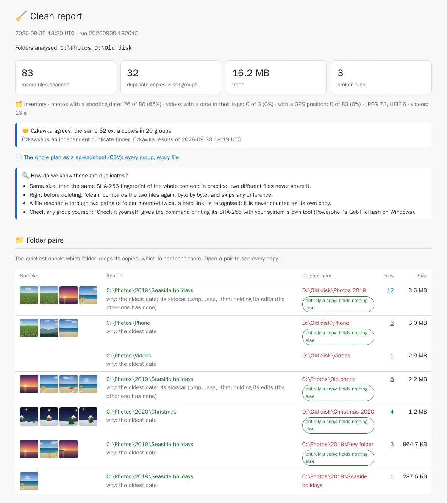

# 8. Clean

[Documentation](../README.md) › Cleaning, step 8 of 13 · 🇫🇷 [Français](../../fr/clean/08-clean.md)

You have audited, read the folder pairs, maybe chosen which folders stay. Time to free the
space. `clean` deletes the extra copies, and keeps a written trace of everything so that you can
change your mind.

## Before the first clean

- **Back up your photos**, for instance on an external disk: the tool keeps one copy of each
  photo, not two.
- **Pause cloud synchronisation** (OneDrive, Google Drive, Dropbox, iCloud) while cleaning.
  Otherwise the deletions are copied to the cloud and to your other devices.
- **Audit just before**, with the same options, and read the folder pairs.

## Two more folders: the journal and the quarantine

`clean` needs two folders of yours:

- **the journal** (`/journal`): one file per clean, listing every action. Without it, no `undo`,
  so `clean` refuses to run.
- **the quarantine** (`/quarantine`): where files are *moved* instead of deleted: unreadable
  files, orphan sidecars, and later near duplicates and burst shots.

```powershell
mkdir "$HOME\media-hygiene\journal", "$HOME\media-hygiene\quarantine"
```

## Run the clean

The same command as your audit, with three changes: **no `:ro`** on your folders (the tool must
be allowed to delete), the journal and the quarantine, and `clean` instead of `audit`:

```powershell
docker run --rm -it `
  -v "C:\Photos:/data/c/Photos" `
  -v "D:\Old disk:/data/d/Old disk" `
  -v media-hygiene-cache:/cache `
  -v "$HOME\media-hygiene\reports:/reports" `
  -v "$HOME\media-hygiene\config:/config" `
  -v "$HOME\media-hygiene\journal:/journal" `
  -v "$HOME\media-hygiene\quarantine:/quarantine" `
  cavo789/media-hygiene clean
```

`clean` audits again (quickly, thanks to the cache), shows the same summary and folder pairs,
then **asks before doing anything**:

<!-- capture: clean.txt|re:^1 |❓ -->
```text
1 orphan sidecar (.xmp, .aae, .thm) will be moved to the quarantine.
❓ Delete 32 duplicate copies (13.9 MB) and handle 3 broken files? [y/N] y
```

Anything but `y` stops here, and nothing changes. With `y`:

<!-- capture: clean.txt|re:^─+ Clean| -->
```text
──────────────────────────────────── Clean ─────────────────────────────────────
Clean 20260930-182011
┌──────────────────────────┬─────────┐
│ Files processed          │      36 │
│ Size                     │ 15.5 MB │
│ Moved to the quarantine  │       3 │
│ Skipped (left untouched) │       0 │
│ Failed                   │       0 │
│ Duration                 │     0 s │
└──────────────────────────┴─────────┘
✅ HTML report: /reports/20260930-182011-clean/report.html
💡 Open index.html in the folder mounted on /reports: it lists every report.
💡 Changed your mind? 'media-hygiene undo 20260930-182011' restores everything.
💡 Moved files are in /quarantine/20260930-182011; 'purge' deletes them.
```

| Line | What it means |
|---|---|
| Files processed | Every file acted upon: here 32 extra copies and 1 empty file deleted, 3 files moved. |
| Size | Their total size. |
| Moved to the quarantine | Unreadable files and orphan sidecars, set aside rather than deleted. |
| Skipped (left untouched) | Files the last check refused (see below). Nothing is forced. |
| Failed | Files the system would not let the tool handle. The report lists them. |

## What happened to each file

| File | What `clean` did |
|---|---|
| Extra copy of a photo or video | **Deleted**, right after comparing it byte for byte with the kept copy once more. Different in any way? Skipped. |
| Empty file (0 bytes) | Deleted. |
| Unreadable file (truncated, damaged) | **Moved** to the quarantine. |
| Orphan [sidecar](../reference-sidecars.md) | Moved to the quarantine. |
| Near duplicates, burst shots | **Untouched**: only if you ask ([step 10](10-review-bursts.md), [step 11](11-near-duplicates.md)). |
| Files of a protected folder | Untouched, always. |

The quarantine holds one folder per clean, named after the run (its date and time), and keeps
the original paths below it: `quarantine\<run>\d\Old disk\2020\IMG_1203.jpg`.

## The clean report

Each clean writes its own report, listed in `index.html` next to the audits: what was freed, the
folder pairs as they were cleaned, and the files left untouched, if any.



## Good to know

- **No question asked**: add `--yes` (`clean --yes`), or set `confirm = false` in the `[clean]`
  section of `config.toml`. Without `-it`, `clean` cannot ask and stops: use `--yes` then.
- **Interrupted?** Ctrl+C, a power cut: every action is written to the journal *before* and
  *after* it happens, so `undo` still restores what was done.
- **Refusals that protect you**: `clean` stops before the analysis without a `/journal`, with a
  `:ro` folder, or with a folder it cannot write to. The message says which one.

---

← [7. The configuration file](07-configuration-file.md) · [Documentation](../README.md) · Next: **[9. Undo, history, purge](09-undo-history-purge.md)** →
