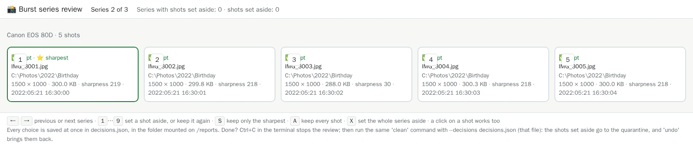
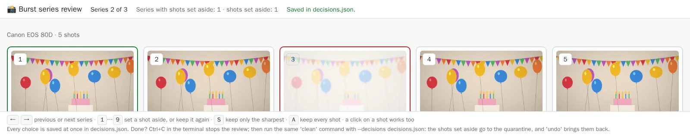

# 10. Sort burst series in your browser

[Documentation](../README.md) › Cleaning, step 10 of 13 · 🇫🇷 [Français](../../fr/clean/10-review-bursts.md)

Phones and cameras take photos in bursts: five, ten, twenty shots in a few seconds. Most are
nearly the same, a few are blurred, one or two are great. Sorting thousands of them file by file
is tedious. `review` shows them to you **one series at a time**, large, in your browser, and
you choose with the keyboard.

## What is a burst series?

Shots of the same camera, taken a few seconds apart, of the same scene. They are **not**
duplicates: each shot is different, and only you know which ones are worth keeping. So the tool
never decides on its own:

- the audit lists the series and marks the sharpest shot ⭐, as a suggestion;
- a plain `clean` never touches them;
- only the shots **you** set aside in `review` are moved, to the quarantine, never deleted.

## Step 1: start the review

`review` needs your folders (read-only is enough: the page never touches a photo) and the reports
folder, where it saves your choices:

```powershell
docker run --rm -it --name media-hygiene-review -p 127.0.0.1::8080 `
  -v "C:\Photos:/data/c/Photos:ro" `
  -v "D:\Old disk:/data/d/Old disk:ro" `
  -v media-hygiene-cache:/cache `
  -v "$HOME\media-hygiene\reports:/reports" `
  cavo789/media-hygiene review
```

Two new parts, on the first line:

| Part | What it means |
|---|---|
| `--name media-hygiene-review` | Gives the container a name, to find its address in step 2. |
| `-p 127.0.0.1::8080` | Opens the page to your browser. `127.0.0.1`: your computer only, nobody else on the network. `::` lets Docker choose a free port. |

The review first audits (quickly, thanks to the cache), then waits for you:

<!-- capture: review.txt|Review ready|http:// -->
```text
✅ Review ready on port 8080: each decision is saved at once in decisions.json.
Ctrl+C stops the review.
💡 Its address on your computer: run 'docker port 8da7555e74ab 8080' in another
terminal, then open http://<that address> in your browser.
```

Leave this window open: the review runs as long as it stays open.

## Step 2: open the page

In **another** PowerShell window, ask Docker which port it chose:

```powershell
docker port media-hygiene-review 8080
```

It answers an address such as `127.0.0.1:49153` (the port changes every time). Open
`http://127.0.0.1:49153` in your browser. The tip of step 1 names the container by its ID
rather than by its name: both work.

## Step 3: read the page

The first series appears. Here, the second one, a birthday: five shots taken one second apart.



- **At the top**: which series you are on (*Series 2 of 3*) and how many shots you have set
  aside so far, across all series.
- **Above the shots**: the camera and the number of shots.
- **Each shot**: its number (the key to press), its state (✅ kept), its name and folder, its
  resolution, size and **sharpness**, and the moment it was taken.
- **⭐ sharpest**: the tool's suggestion, framed in green. The higher the sharpness, the crisper
  the picture: the third shot, at 30 against about 218 for the others, is the blurred one.
- **At the bottom**: the keys, as a reminder.

## Step 4: set a shot aside

Press **`3`**: the blurred shot is set aside. It fades, gets a red frame and the label
📦 *set aside*; the counter at the top goes up, and *Saved in decisions.json* confirms that your
choice is already written:



Press `3` again to keep it after all. A click on a shot does the same as its number.

## Step 5: go faster with the keyboard

| Key | Action |
|---|---|
| `→` or space | Next series |
| `←` | Previous series |
| `1` … `9` | Set that shot aside, or keep it again |
| `S` | Keep only the sharpest shot: every other one is set aside |
| `A` | Keep every shot of the series again |

On an AZERTY keyboard, the digits of the top row work **without** Shift.

Two safeguards: each series always keeps at least one shot, and a shot in a
[protected folder](05-choose-the-kept-copy.md#protect-a-folder) can never be set aside.

## Step 6: stop, and come back later

Every choice is saved **at once** in `decisions.json`, in your reports folder. Stop whenever you
like: **Ctrl+C** in the review window. The next `review` finds your choices again and resumes.

The file lists, series by series, the shots kept and the shots set aside:

<!-- capture: decisions.json -->
```json
{
  "version": 1,
  "report": "",
  "roots": [
    "C:\\Photos",
    "D:\\Old disk"
  ],
  "pairs": [],
  "bursts": [
    {
      "kept": [
        "C:\\Photos\\2022\\Birthday\\IMG_3001.jpg",
        "C:\\Photos\\2022\\Birthday\\IMG_3002.jpg",
        "C:\\Photos\\2022\\Birthday\\IMG_3004.jpg",
        "C:\\Photos\\2022\\Birthday\\IMG_3005.jpg"
      ],
      "discarded": [
        "C:\\Photos\\2022\\Birthday\\IMG_3003.jpg"
      ]
    },
    {
      "kept": [
        "C:\\Photos\\2023\\Lake\\IMG_4001.jpg",
        "C:\\Photos\\2023\\Lake\\IMG_4002.jpg",
        "C:\\Photos\\2023\\Lake\\IMG_4003.jpg"
      ],
      "discarded": [
        "C:\\Photos\\2023\\Lake\\IMG_4004.jpg"
      ]
    }
  ]
}
```

## Step 7: apply your choices

The page itself never moves anything. Once done, run your `clean` command of
[step 8](08-clean.md) with `--decisions decisions.json`:

```powershell
docker run --rm -it `
  -v "C:\Photos:/data/c/Photos" `
  -v "D:\Old disk:/data/d/Old disk" `
  -v media-hygiene-cache:/cache `
  -v "$HOME\media-hygiene\reports:/reports" `
  -v "$HOME\media-hygiene\config:/config" `
  -v "$HOME\media-hygiene\journal:/journal" `
  -v "$HOME\media-hygiene\quarantine:/quarantine" `
  cavo789/media-hygiene clean --decisions decisions.json
```

Before its question, `clean` announces the shots it will move:

<!-- capture: clean-near.txt|burst shots|. -->
```text
2 burst shots you set aside will be moved to the quarantine.
```

The shots set aside are **moved to the quarantine**, not deleted: they are not copies, nothing
could rebuild them. `undo` puts them back; `purge` deletes them for good
([step 9](09-undo-history-purge.md)).

## Good to know

- **Same options for `review` and `clean`**: give both the same `--prefer`, `--protect` and
  `--exclude` (or keep them in `config.toml`). If a series changed between the review and the
  clean (a file added, moved or edited), `clean` refuses the file rather than guessing: review
  again.
- **Before moving a shot**, `clean` checks that it is the very file the review showed, and that
  the shots you kept are still there.
- **`review --decisions other.json`** saves the choices in another file of the reports folder.
- **`review --port 9000`** changes the port inside the container; publish it with
  `-p 127.0.0.1::9000`.
- **The same `decisions.json`** can also hold your [folder-pair decisions](12-decide-pair-by-pair.md):
  `review` keeps them.

---

← [9. Undo, history, purge](09-undo-history-purge.md) · [Documentation](../README.md) · Next: **[11. Near duplicates](11-near-duplicates.md)** →
