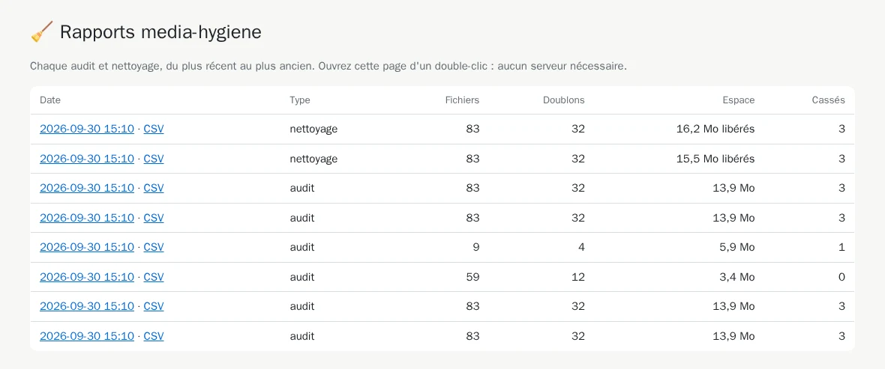
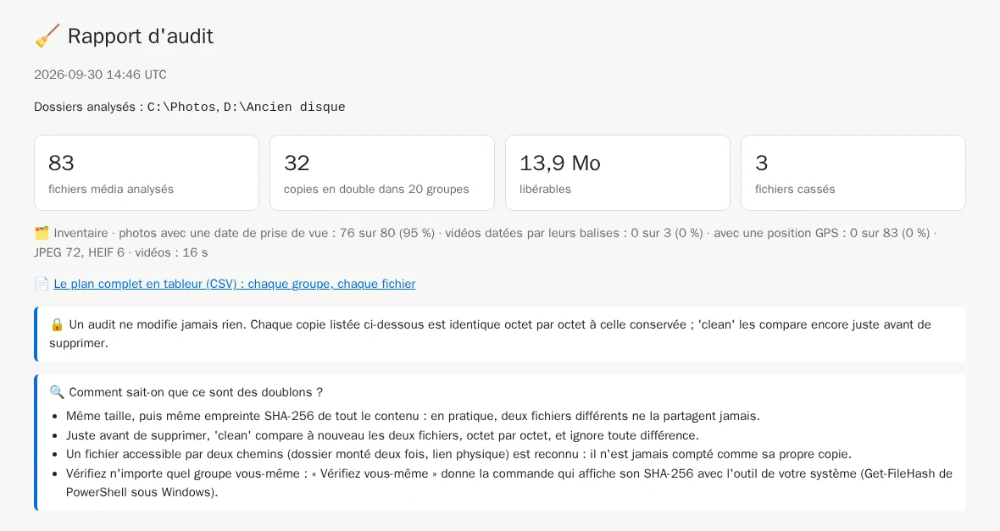
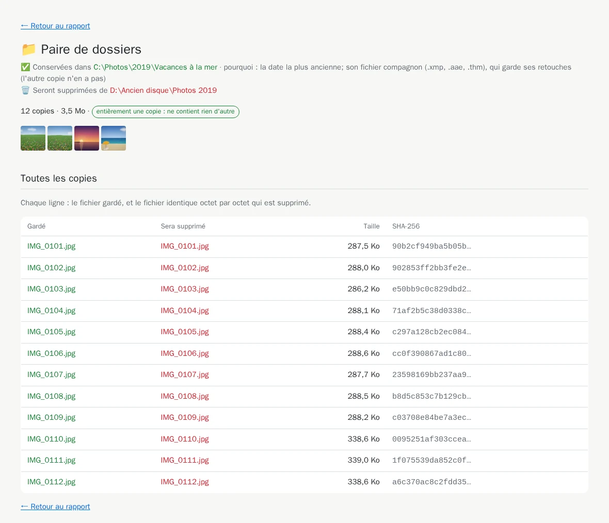
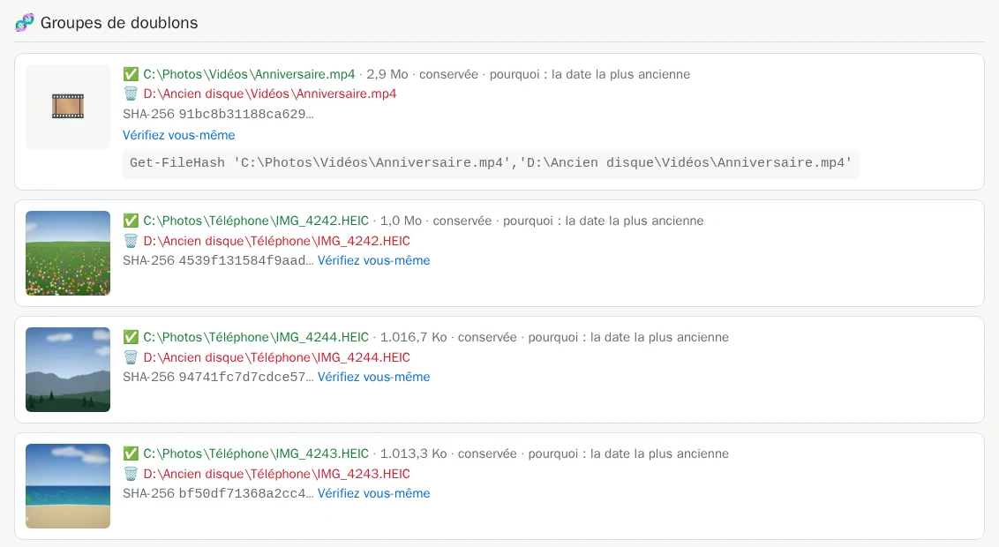
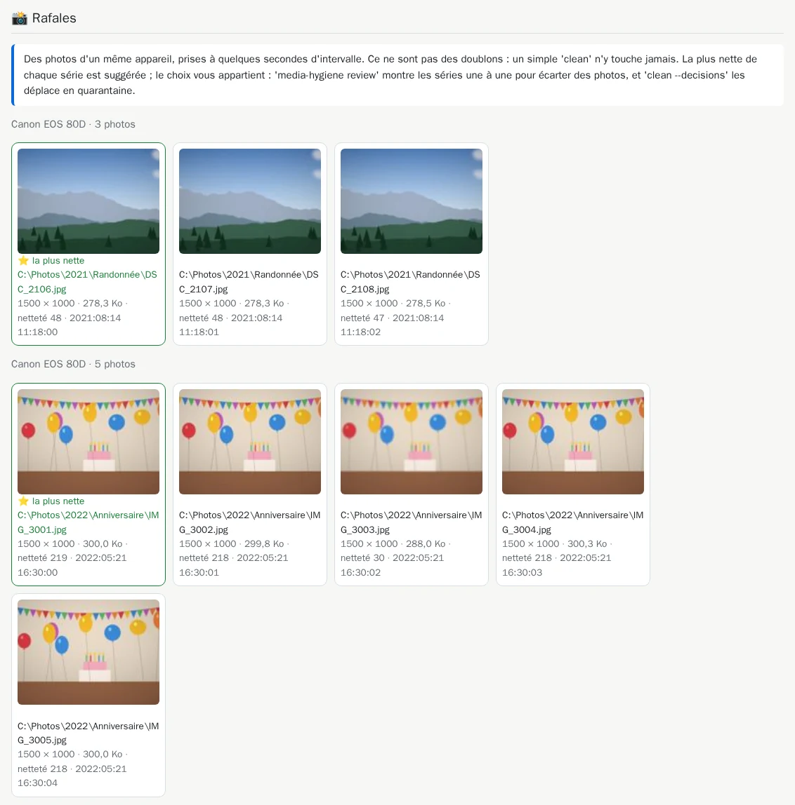
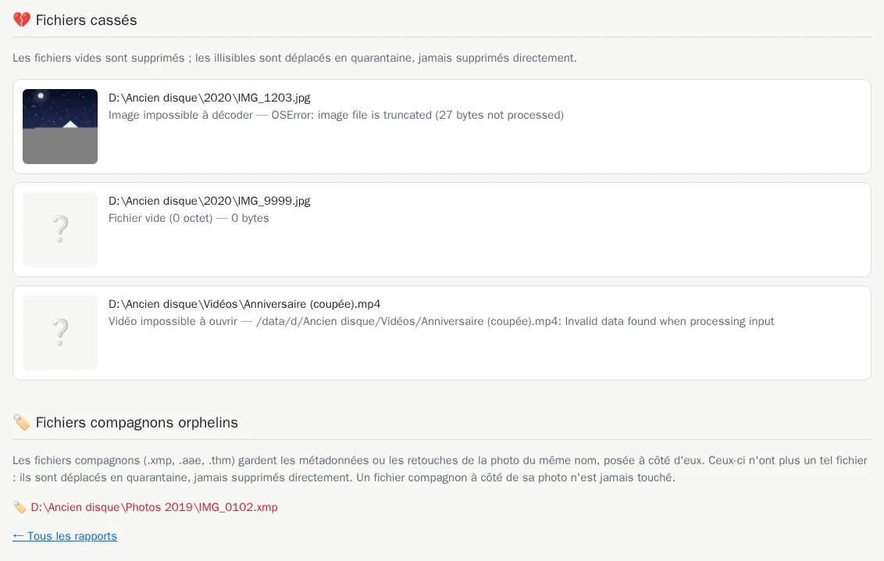

# 4. Le rapport HTML

[Documentation](README.md) › Étape 4 sur 13 · 🇬🇧 [English](../en/04-html-report.md)

Le terminal donne les totaux et les paires de dossiers. Le rapport montre le reste : les images
elles-mêmes, chaque copie ligne par ligne, et la preuve qu'elles sont identiques. C'est une page
web qui s'ouvre dans votre navigateur, sans serveur ni connexion internet.

## Donner un dossier de rapports à l'outil

Créez une fois un dossier pour les rapports, puis montez-le sur `/reports` :

```powershell
mkdir "$HOME\media-dedup\reports"
docker run --rm -it `
  -v "C:\Photos:/data/c/Photos:ro" `
  -v "D:\Ancien disque:/data/d/Ancien disque:ro" `
  -v media-dedup-cache:/cache `
  -v "$HOME\media-dedup\reports:/reports" `
  cavo789/media-dedup --locale fr audit
```

`$HOME` est votre dossier personnel (`C:\Users\<vous>`) : les rapports arrivent dans
`C:\Users\<vous>\media-dedup\reports`. Créez le dossier **avant** le premier lancement : un
dossier que Docker crée lui-même appartient à l'administrateur, et l'outil ne pourrait pas y
écrire ([pourquoi](reference-troubleshooting.md#dossiers-où-loutil-ne-peut-pas-écrire)).

À la fin de l'audit, deux nouvelles lignes :

<!-- capture: audit.txt|Rapport HTML|Ouvrez index.html -->
```text
✅ Rapport HTML : /reports/20260927-064328-audit/report.html
💡 Ouvrez index.html dans le dossier monté sur /reports : il liste tous les
rapports.
```

## L'ouvrir

Ouvrez `C:\Users\<vous>\media-dedup\reports` dans l'Explorateur et double-cliquez sur
`index.html`. Il liste chaque audit et chaque nettoyage, du plus récent au plus ancien :



Cliquez sur une date pour ouvrir ce rapport. Chaque exécution a son propre dossier, nommé
d'après sa date et son type (`AAAAMMJJ-HHMMSS-audit`), qui contient `report.html`, les
vignettes et `plan.csv`.

## Le haut : les totaux



Les mêmes chiffres que dans le terminal, puis un rappel : un audit ne modifie rien, et chaque
copie listée est identique octet par octet à celle gardée.

## Les paires de dossiers : la vérification la plus rapide

Commencez ici. Chaque ligne est une paire de dossiers : celui qui garde ses copies (en vert),
celui qui les perd (en rouge), avec quelques images d'exemple, le nombre de fichiers et l'espace
libéré.


- **pourquoi :** la règle qui a choisi le dossier gardé ([les règles](05-choose-the-kept-copy.md)).
- Le badge **entièrement une copie : ne contient rien d'autre** signale un dossier sans rien à
  lui.
- **Votre décision** permet d'inverser une paire ou de ne pas y toucher : l'[étape 12](12-decide-pair-by-pair.md)
  l'explique. D'ici là, ignorez-la.

Cliquez sur le nombre de fichiers d'une paire pour voir chaque copie, ligne par ligne :



## Les groupes de fichiers identiques

Plus bas, un échantillon aléatoire de groupes de photos (les mêmes à chaque exécution), puis les
plus gros groupes d'abord. Chaque groupe montre la copie gardée ✅, les copies à supprimer 🗑️, et
l'empreinte SHA-256 qu'elles partagent.



**Vérifiez vous-même** donne une commande pour PowerShell. Collez-la : Windows calcule lui-même
l'empreinte de chaque copie, et elles sont toutes identiques. Vous n'avez pas à croire
media-dedup sur parole.

## Quasi-doublons et rafales

Deux sections montrent côte à côte des images qui ne sont *pas* des fichiers identiques. Il ne
leur arrive rien, sauf si vous le demandez :

- **Quasi-doublons** : la même photo enregistrée à nouveau, plus petite ou recompressée
  ([étape 11](11-near-duplicates.md)).

  

- **Rafales** : des photos prises à quelques secondes d'intervalle, la plus nette marquée ⭐
  ([étape 10](10-review-bursts.md)).

  

## Fichiers cassés et fichiers compagnons orphelins



Les fichiers vides seront supprimés ; les illisibles déplacés en quarantaine, jamais supprimés
directement. Les [fichiers compagnons](reference-sidecars.md) restés sans leur photo sont aussi
déplacés en quarantaine.

## Chaque fichier dans un tableur : `plan.csv`

À côté de chaque rapport, `plan.csv` liste **chaque** fichier du plan, sans limite : groupe,
SHA-256, taille, action, chemin, dossier, date et la règle qui a choisi la copie gardée. Il
s'ouvre directement dans Excel, accents compris (séparateur `;` en français) :

<!-- capture: plan-csv.txt -->
```text
Groupe;SHA-256;Taille (octets);Action;Fichier;Dossier;Modifié (UTC);Détail
1;91bc8b31188ca6292c832b144f0d1bba48af3fb7bc752555c76a1459b3d9823e;3009124;garder;C:\Photos\Vidéos\Anniversaire.mp4;C:\Photos\Vidéos;2022-05-21 16:35:00;la date la plus ancienne
1;91bc8b31188ca6292c832b144f0d1bba48af3fb7bc752555c76a1459b3d9823e;3009124;supprimer;D:\Ancien disque\Vidéos\Anniversaire.mp4;D:\Ancien disque\Vidéos;2024-01-15 20:30:00;
2;4539f131584f9aad4d619782848f952577e9f0781afae06398ac3b79f9e93978;1073000;garder;C:\Photos\Téléphone\IMG_4242.HEIC;C:\Photos\Téléphone;2024-04-06 11:00:00;la date la plus ancienne
2;4539f131584f9aad4d619782848f952577e9f0781afae06398ac3b79f9e93978;1073000;supprimer;D:\Ancien disque\Téléphone\IMG_4242.HEIC;D:\Ancien disque\Téléphone;2024-08-02 20:30:00;
3;94741fc7d7cdce5722487c17bf48f123321dbbab8eea850e7be2a0e99edb8e54;1041095;garder;C:\Photos\Téléphone\IMG_4244.HEIC;C:\Photos\Téléphone;2024-04-06 12:22:00;la date la plus ancienne
```

## Lister et ranger les rapports

`reports` liste les rapports et régénère `index.html` ; `reports --prune 10` garde les dix plus
récents et supprime les autres :

```powershell
docker run --rm -it -v "$HOME\media-dedup\reports:/reports" cavo789/media-dedup --locale fr reports
```

<!-- capture: reports.txt -->
```text
Rapports (du plus récent au plus ancien)
┏━━━━━━━━━━━━━━━━━━━━━━━┳━━━━━━━━━━━┳━━━━━━━━━━┳━━━━━━━━━━┳━━━━━━━━━┳━━━━━━━━┓
┃ Dossier               ┃ Type      ┃ Fichiers ┃ Doublons ┃ Espace  ┃ Cassés ┃
┡━━━━━━━━━━━━━━━━━━━━━━━╇━━━━━━━━━━━╇━━━━━━━━━━╇━━━━━━━━━━╇━━━━━━━━━╇━━━━━━━━┩
│ 20260927-064358-clean │ nettoyage │ 83       │ 32       │ 16,2 Mo │ 3      │
│ 20260927-064355-clean │ nettoyage │ 83       │ 32       │ 15,5 Mo │ 3      │
│ 20260927-064340-audit │ audit     │ 83       │ 32       │ 13,9 Mo │ 3      │
│ 20260927-064335-audit │ audit     │ 83       │ 32       │ 13,9 Mo │ 3      │
│ 20260927-064333-audit │ audit     │ 9        │ 4        │ 5,9 Mo  │ 1      │
│ 20260927-064332-audit │ audit     │ 59       │ 12       │ 3,4 Mo  │ 0      │
│ 20260927-064330-audit │ audit     │ 83       │ 32       │ 13,9 Mo │ 3      │
│ 20260927-064328-audit │ audit     │ 83       │ 32       │ 13,9 Mo │ 3      │
└───────────────────────┴───────────┴──────────┴──────────┴─────────┴────────┘
💡 Double-cliquez sur index.html dans le dossier monté sur /reports.
```

---

← [3. Plusieurs dossiers et disques](03-several-folders.md) · [Documentation](README.md) · Suivant : **[5. Choisir la copie gardée](05-choose-the-kept-copy.md)** →
