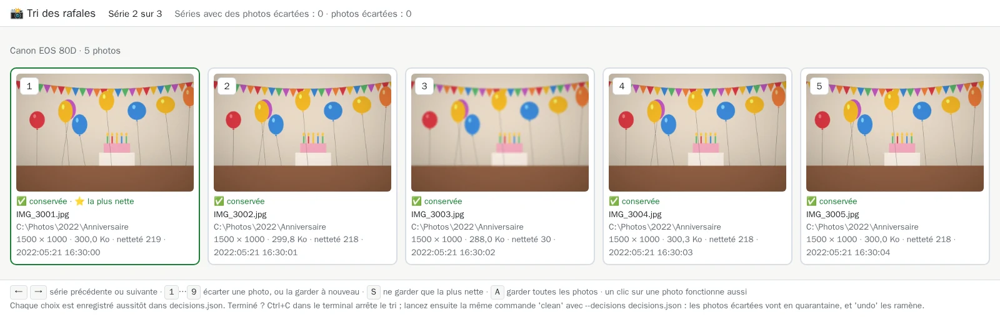
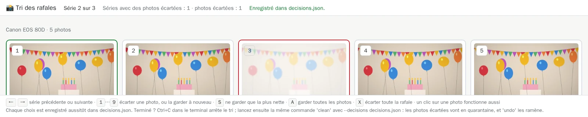

# 10. Trier les rafales dans le navigateur

[Documentation](../README.md) › Nettoyer, étape 10 sur 13 · 🇬🇧 [English](../../en/clean/10-review-bursts.md)

Les téléphones et appareils photo prennent des rafales : cinq, dix, vingt photos en quelques
secondes. La plupart se ressemblent, quelques-unes sont floues, une ou deux sont réussies. Les
trier par milliers, fichier par fichier, est fastidieux. `review` vous les montre **une série à
la fois**, en grand, dans votre navigateur, et vous choisissez au clavier.

## Qu'est-ce qu'une rafale ?

Des photos d'un même appareil, prises à quelques secondes d'intervalle, de la même scène. Ce ne
sont **pas** des doublons : chaque photo est différente, et vous seul·e savez lesquelles méritent
d'être gardées. L'outil ne décide donc jamais seul :

- l'audit liste les séries et marque la photo la plus nette ⭐, comme suggestion ;
- un simple `clean` n'y touche jamais ;
- seules les photos que **vous** écartez dans `review` sont déplacées, en quarantaine, jamais
  supprimées.

## Étape 1 : lancer le tri

`review` a besoin de vos dossiers (la lecture seule suffit : la page ne touche jamais une photo)
et du dossier des rapports, où il enregistre vos choix :

```powershell
docker run --rm -it --name media-hygiene-review -p 127.0.0.1::8080 `
  -v "C:\Photos:/data/c/Photos:ro" `
  -v "D:\Ancien disque:/data/d/Ancien disque:ro" `
  -v media-hygiene-cache:/cache `
  -v "$HOME\media-hygiene\reports:/reports" `
  cavo789/media-hygiene --locale fr review
```

Deux nouveautés, sur la première ligne :

| Morceau | Ce qu'il veut dire |
|---|---|
| `--name media-hygiene-review` | Donne un nom au conteneur, pour retrouver son adresse à l'étape 2. |
| `-p 127.0.0.1::8080` | Ouvre la page à votre navigateur. `127.0.0.1` : votre ordinateur seulement, personne d'autre sur le réseau. `::` laisse Docker choisir un port libre. |

Le tri commence par un audit (rapide, grâce au cache), puis vous attend :

<!-- capture: review.txt|Tri prêt|http:// -->
```text
✅ Tri prêt sur le port 8080 : chaque décision est enregistrée aussitôt dans
decisions.json. Ctrl+C arrête le tri.
💡 Son adresse sur votre ordinateur : lancez 'docker port 625e4152b3ec 8080'
dans un autre terminal, puis ouvrez http://<cette adresse> dans votre
navigateur.
```

Laissez cette fenêtre ouverte : le tri tourne tant qu'elle reste ouverte.

## Étape 2 : ouvrir la page

Dans une **autre** fenêtre PowerShell, demandez à Docker quel port il a choisi :

```powershell
docker port media-hygiene-review 8080
```

Il répond une adresse comme `127.0.0.1:49153` (le port change à chaque fois). Ouvrez
`http://127.0.0.1:49153` dans votre navigateur. L'astuce de l'étape 1 désigne le conteneur par
son identifiant plutôt que par son nom : les deux fonctionnent.

## Étape 3 : lire la page

La première série s'affiche. Ici, la deuxième, un anniversaire : cinq photos prises à une
seconde d'intervalle.



- **En haut** : la série où vous êtes (*Série 2 sur 3*) et combien de photos vous avez écartées
  jusqu'ici, toutes séries confondues.
- **Au-dessus des photos** : l'appareil et le nombre de photos.
- **Chaque photo** : son numéro (la touche à presser), son état (✅ conservée), son nom et son
  dossier, sa résolution, sa taille et sa **netteté**, et le moment de la prise de vue.
- **⭐ la plus nette** : la suggestion de l'outil, encadrée en vert. Plus la netteté est haute,
  plus l'image est piquée : la troisième photo, à 30 contre environ 218 pour les autres, est la
  floue.
- **En bas** : les touches, pour mémoire.

## Étape 4 : écarter une photo

Pressez **`3`** : la photo floue est écartée. Elle pâlit, prend un cadre rouge et l'étiquette
📦 *écartée* ; le compteur du haut augmente, et *Enregistré dans decisions.json* confirme que
votre choix est déjà écrit :



Pressez à nouveau `3` pour finalement la garder. Un clic sur une photo fait comme son numéro.

## Étape 5 : aller plus vite au clavier

| Touche | Action |
|---|---|
| `→` ou espace | Série suivante |
| `←` | Série précédente |
| `1` … `9` | Écarter cette photo, ou la garder à nouveau |
| `S` | Ne garder que la plus nette : toutes les autres sont écartées |
| `A` | Garder à nouveau toutes les photos de la série |
| `X` | Écarter toute la rafale : aucune de ses photos ne vaut la peine (`X` à nouveau les garde toutes) |

Sur un clavier AZERTY, les chiffres de la rangée du haut fonctionnent **sans** Maj.

`X` écarte toutes les photos de la série : elles pâlissent, et un bandeau rouge rappelle que
toute la rafale part en quarantaine. Écarter les photos une à une s'arrête à la dernière, pour
qu'une série entière ne parte jamais par erreur : il faut `X`.

Une photo d'un [dossier protégé](05-choose-the-kept-copy.md#protéger-un-dossier) ne peut jamais
être écartée : `X` écarte les autres, et la protégée reste.

## Étape 6 : arrêter, et reprendre plus tard

Chaque choix est enregistré **aussitôt** dans `decisions.json`, dans votre dossier de rapports.
Arrêtez quand vous voulez : **Ctrl+C** dans la fenêtre du tri. Le `review` suivant retrouve vos
choix et reprend.

Le fichier liste, série par série, les photos gardées et les photos écartées (une série écartée
avec `X` a une liste `kept` vide) :

<!-- capture: decisions.json -->
```json
{
  "version": 1,
  "report": "",
  "roots": [
    "C:\\Photos",
    "D:\\Ancien disque"
  ],
  "pairs": [],
  "bursts": [
    {
      "kept": [
        "C:\\Photos\\2022\\Anniversaire\\IMG_3001.jpg",
        "C:\\Photos\\2022\\Anniversaire\\IMG_3002.jpg",
        "C:\\Photos\\2022\\Anniversaire\\IMG_3004.jpg",
        "C:\\Photos\\2022\\Anniversaire\\IMG_3005.jpg"
      ],
      "discarded": [
        "C:\\Photos\\2022\\Anniversaire\\IMG_3003.jpg"
      ]
    },
    {
      "kept": [
        "C:\\Photos\\2023\\Lac\\IMG_4001.jpg",
        "C:\\Photos\\2023\\Lac\\IMG_4002.jpg",
        "C:\\Photos\\2023\\Lac\\IMG_4003.jpg"
      ],
      "discarded": [
        "C:\\Photos\\2023\\Lac\\IMG_4004.jpg"
      ]
    }
  ]
}
```

## Étape 7 : appliquer vos choix

La page elle-même ne déplace jamais rien. Une fois le tri fini, lancez votre commande `clean` de
l'[étape 8](08-clean.md) avec `--decisions decisions.json` :

```powershell
docker run --rm -it `
  -v "C:\Photos:/data/c/Photos" `
  -v "D:\Ancien disque:/data/d/Ancien disque" `
  -v media-hygiene-cache:/cache `
  -v "$HOME\media-hygiene\reports:/reports" `
  -v "$HOME\media-hygiene\config:/config" `
  -v "$HOME\media-hygiene\journal:/journal" `
  -v "$HOME\media-hygiene\quarantine:/quarantine" `
  cavo789/media-hygiene --locale fr clean --decisions decisions.json
```

Avant sa question, `clean` annonce les photos qu'il va déplacer :

<!-- capture: clean-near.txt|photos de rafale|. -->
```text
2 photos de rafale que vous avez écartées seront déplacées en quarantaine.
```

Les photos écartées sont **déplacées en quarantaine**, pas supprimées : ce ne sont pas des
copies, rien ne pourrait les reconstruire. `undo` les remet en place ; `purge` les supprime pour
de bon ([étape 9](09-undo-history-purge.md)).

## Bon à savoir

- **Mêmes options pour `review` et `clean`** : donnez aux deux les mêmes `--prefer`, `--protect`
  et `--exclude` (ou gardez-les dans `config.toml`). Si une série a changé entre le tri et le
  nettoyage (un fichier ajouté, déplacé ou modifié), `clean` refuse le fichier plutôt que de
  deviner : refaites le tri.
- **Avant de déplacer une photo**, `clean` vérifie que c'est bien le fichier montré par le tri, et
  que les photos que vous avez gardées, s'il y en a, sont toujours là.
- **`review --decisions autre.json`** enregistre les choix dans un autre fichier du dossier des
  rapports.
- **`review --port 9000`** change le port dans le conteneur ; publiez-le avec
  `-p 127.0.0.1::9000`.
- **Le même `decisions.json`** peut aussi contenir vos [décisions sur les paires de dossiers](12-decide-pair-by-pair.md) :
  `review` les conserve.

---

← [9. Annuler, historique, purge](09-undo-history-purge.md) · [Documentation](../README.md) · Suivant : **[11. Les quasi-doublons](11-near-duplicates.md)** →
