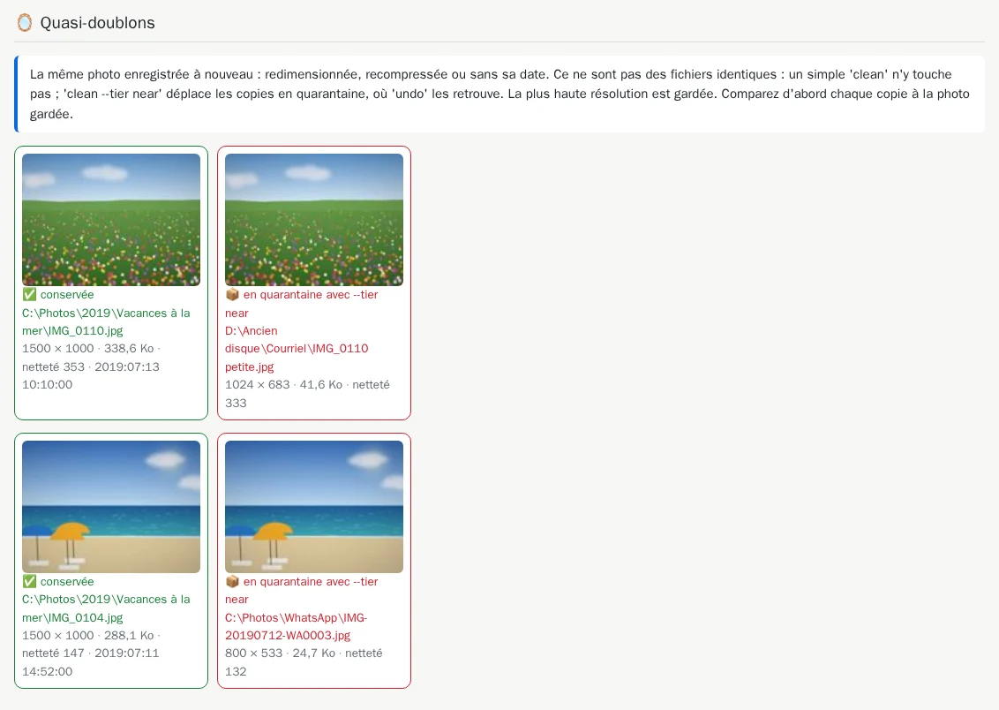

# 11. Les quasi-doublons

[Documentation](../README.md) › Nettoyer, étape 11 sur 13 · 🇬🇧 [English](../../en/clean/11-near-duplicates.md)

Certaines copies ne sont pas des fichiers identiques, et pourtant c'est la même image : la photo
envoyée par WhatsApp (plus petite), celle « réduite pour l'e-mail », une copie réenregistrée avec
une autre qualité, redressée, ou sans sa date. L'audit les trouve aussi, comme
**quasi-doublons**, et n'y touche pas, sauf si vous le demandez.

## Comment l'outil les reconnaît

Pendant qu'il vérifie que chaque photo est lisible, l'audit décrit aussi à quoi elle ressemble
(empreintes perceptuelles, netteté, date et appareil EXIF) et le garde dans le cache. Deux photos
ne sont des quasi-doublons que si **tous** les tests sont d'accord :

- des empreintes perceptuelles presque identiques ;
- la même forme (proportions) ;
- la même date de prise de vue, ou aucune date sur la plus petite copie.

Les images vides ou noires ne comptent jamais, et une photo d'une [rafale](10-review-bursts.md)
n'est jamais prise pour un quasi-doublon. Dans chaque groupe, la **plus haute résolution** est
gardée.

## Les regarder d'abord

La section *Quasi-doublons* du [rapport HTML](04-html-report.md) montre chaque groupe côte à côte,
avec la résolution, la taille et la netteté de chaque copie :



Comparez chaque copie avec celle gardée. Le résumé de l'audit les compte sur la ligne
*Quasi-doublons (déplacés seulement avec --tier near)*.

## Les déplacer : `clean --tier near`

Ajoutez `--tier near` à votre commande `clean` de l'[étape 8](08-clean.md). Ici, il est combiné
avec les décisions de rafales de l'étape 10 ; chaque option fonctionne aussi seule :

```powershell
docker run --rm -it `
  -v "C:\Photos:/data/c/Photos" `
  -v "D:\Ancien disque:/data/d/Ancien disque" `
  -v media-hygiene-cache:/cache `
  -v "$HOME\media-hygiene\reports:/reports" `
  -v "$HOME\media-hygiene\config:/config" `
  -v "$HOME\media-hygiene\journal:/journal" `
  -v "$HOME\media-hygiene\quarantine:/quarantine" `
  cavo789/media-hygiene --locale fr clean --tier near --decisions decisions.json
```

La question mentionne maintenant les quasi-doublons :

<!-- capture: clean-near.txt|re:^2 |❓ -->
```text
2 photos de rafale que vous avez écartées seront déplacées en quarantaine.
1 fichier compagnon orphelin (.xmp, .aae, .thm) sera déplacé en quarantaine.
❓ Supprimer 32 copies en double (13,9 Mo), déplacer 2 quasi-doublons en
quarantaine et traiter 3 fichiers cassés ? [o/N] o
```

<!-- capture: clean-near.txt|re:^─+ Nettoyage| -->
```text
────────────────────────────────── Nettoyage ───────────────────────────────────
Nettoyage 20261001-122508
┌───────────────────────────┬─────────┐
│ Fichiers traités          │      40 │
│ Taille                    │ 16,2 Mo │
│ Déplacés en quarantaine   │       7 │
│ Ignorés (laissés intacts) │       0 │
│ En échec                  │       0 │
│ Durée                     │     0 s │
└───────────────────────────┴─────────┘
✅ Rapport HTML : /reports/20261001-122508-clean/report.html
💡 Ouvrez index.html dans le dossier monté sur /reports : il liste tous les
rapports.
💡 Vous changez d'avis ? 'media-hygiene undo 20261001-122508' restaure tout.
💡 Les fichiers déplacés sont dans /quarantine/20261001-122508 ; 'purge' les
supprime.
```

Les quasi-doublons sont **déplacés en quarantaine**, jamais supprimés : ils ne sont pas
identiques à la photo gardée, rien ne pourrait donc les reconstruire. La quarantaine contient
maintenant, sous le dossier de ce nettoyage, les quasi-doublons, les photos de rafale écartées,
les fichiers illisibles et le fichier compagnon orphelin :

<!-- capture: quarantine.txt -->
```text
./20261001-122508/c/Photos/2022/Anniversaire/IMG_3003.jpg
./20261001-122508/c/Photos/2023/Lac/IMG_4004.jpg
./20261001-122508/c/Photos/WhatsApp/IMG-20190712-WA0003.jpg
./20261001-122508/d/Ancien disque/2020/IMG_1203.jpg
./20261001-122508/d/Ancien disque/Courriel/IMG_0110 petite.jpg
./20261001-122508/d/Ancien disque/Photos 2019/IMG_0102.xmp
./20261001-122508/d/Ancien disque/Vidéos/Anniversaire (coupée).mp4
```

Avant de déplacer chaque copie, `clean` vérifie que la photo gardée existe toujours et que la
copie est bien le fichier vu par l'audit. `undo` les remet en place ; `purge` les supprime pour
de bon ([étape 9](09-undo-history-purge.md)).

---

← [10. Trier les rafales dans le navigateur](10-review-bursts.md) · [Documentation](../README.md) · Suivant : **[12. Décider paire par paire](12-decide-pair-by-pair.md)** →
