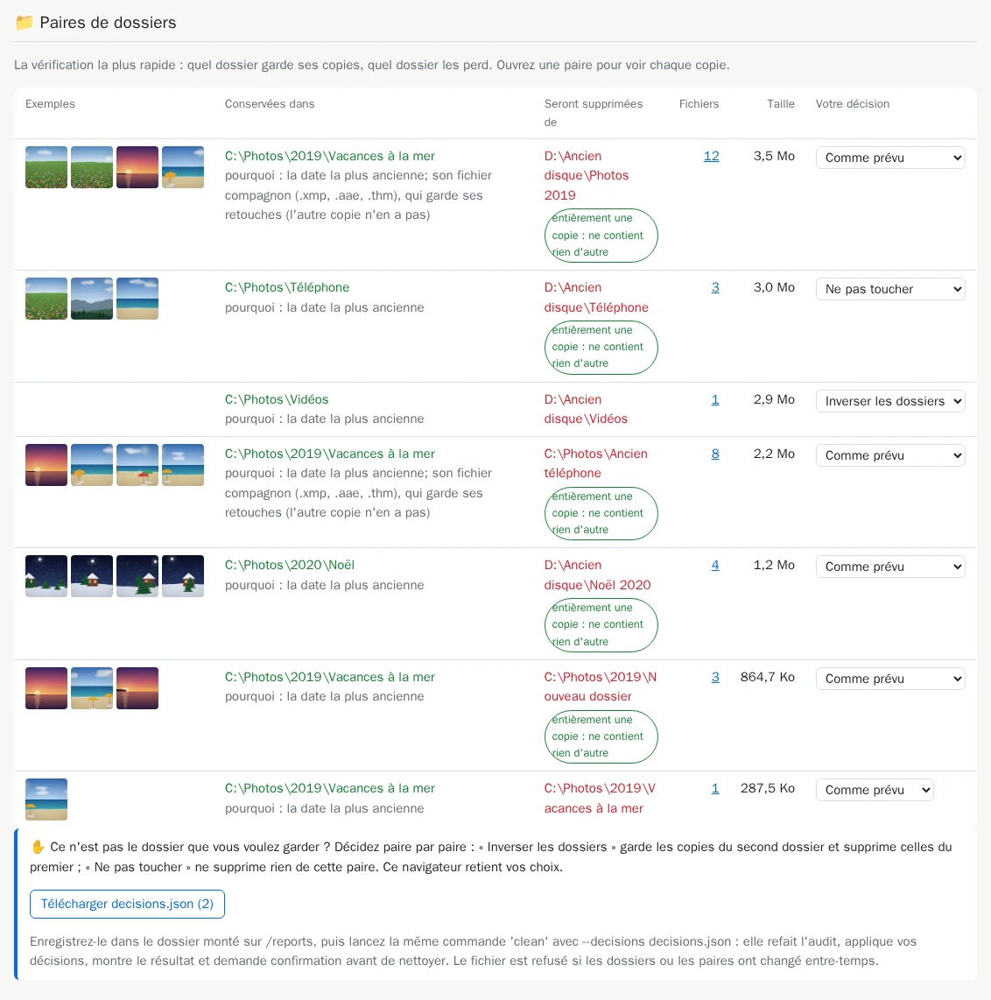

# 12. Décider paire par paire

[Documentation](../README.md) › Nettoyer, étape 12 sur 13 · 🇬🇧 [English](../../en/clean/12-decide-pair-by-pair.md)

[`--prefer`](05-choose-the-kept-copy.md) change le choix pour tout un dossier, partout. Parfois,
vous n'êtes en désaccord qu'avec une seule paire : garder l'autre côté, ou ne pas toucher à cette
paire. Le rapport d'audit vous laisse décider paire par paire, d'un clic.

## Étape 1 : choisir dans le rapport

Dans le tableau *Paires de dossiers* d'un rapport d'**audit**, chaque paire a une liste
*Votre décision* :

| Choix | Ce que `clean` fera de cette paire |
|---|---|
| Comme prévu | Garder les copies du premier dossier, supprimer celles du second. |
| Inverser les dossiers | Garder les copies du **second** dossier, supprimer celles du premier. |
| Ne pas toucher | Ne rien supprimer de cette paire. |

Ici, les vidéos ne sont pas touchées et la paire `Ancien téléphone` est inversée :



Votre navigateur retient vos choix, même si vous fermez la page. *Inverser les dossiers* n'est
pas proposé pour les copies d'un même dossier : il n'y a rien à inverser.

## Étape 2 : télécharger le fichier

Cliquez sur **Télécharger decisions.json** ; le nombre entre parenthèses compte vos décisions.
Enregistrez le fichier dans votre dossier de rapports (`C:\Users\<vous>\media-hygiene\reports`), à
côté d'`index.html`.

## Étape 3 : nettoyer avec vos décisions

Lancez votre commande `clean` de l'[étape 8](08-clean.md) avec `--decisions decisions.json` (un
chemin relatif est lu dans le dossier des rapports) :

```powershell
cavo789/media-hygiene --locale fr clean --decisions decisions.json
```

(avec la même partie `docker run … -v …` qu'à l'étape 8)

La page elle-même ne supprime jamais rien. `clean` refait l'audit, applique vos décisions, montre
les paires de dossiers qui en résultent, et demande confirmation avant de nettoyer, avec toutes
les protections : comparaison octet par octet, journal, `undo`.

## Quand le fichier est refusé

Par sécurité, `clean` refuse le fichier plutôt que de deviner quand :

- d'autres dossiers sont montés que pour le rapport ;
- une paire décidée n'existe plus (des fichiers ont changé depuis le rapport) : refaites l'audit,
  décidez à nouveau ;
- une inversion supprimerait les copies d'un dossier protégé.

## Un seul fichier pour tout

Le même `decisions.json` peut contenir les paires de dossiers **et** les photos de rafale de
l'[étape 10](10-review-bursts.md) : `review` conserve les paires déjà présentes dans le fichier,
et un seul `clean --decisions decisions.json` applique les deux.

---

← [11. Les quasi-doublons](11-near-duplicates.md) · [Documentation](../README.md) · Suivant : **[13. Un second avis](13-second-opinion.md)** →
