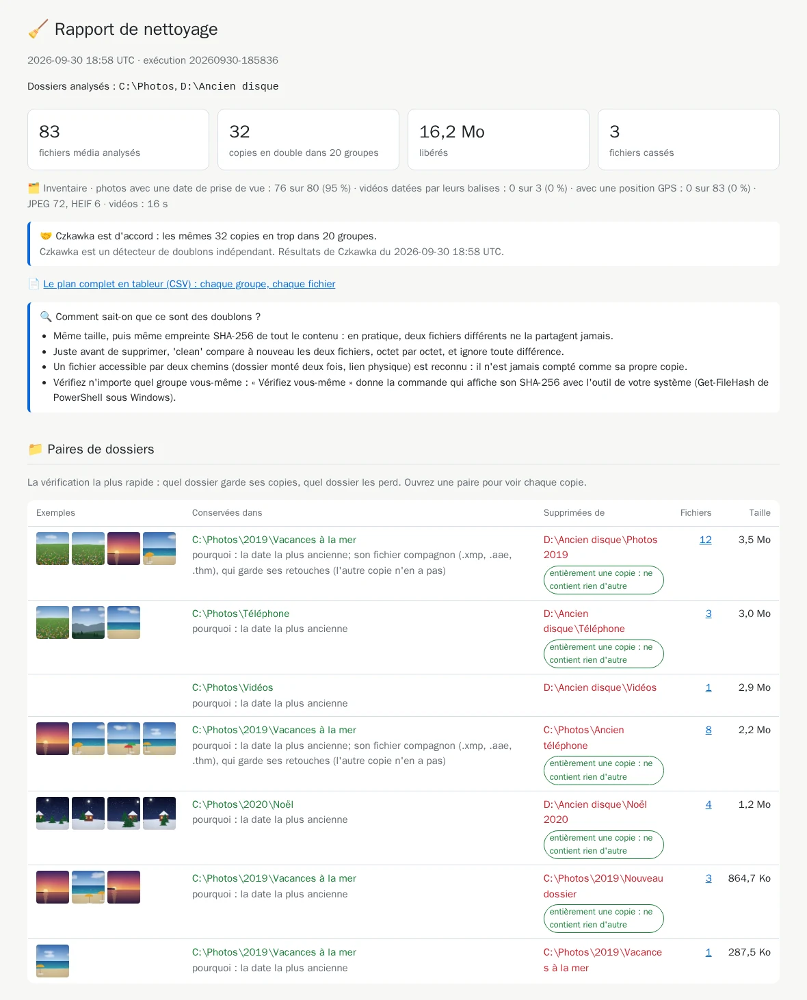

# 13. Un second avis

[Documentation](../README.md) › Nettoyer, étape 13 sur 13 · 🇬🇧 [English](../../en/clean/13-second-opinion.md)

Avant de supprimer des photos de famille, un second avis rassure.
[Czkawka](https://github.com/qarmin/czkawka) est un détecteur de doublons indépendant et open
source, écrit différemment et avec une autre fonction de hachage. Deux outils écrits
indépendamment font rarement la même erreur : s'ils sont d'accord, vous pouvez nettoyer en
confiance.

Cette étape est facultative : `clean` ne l'exige jamais.

## Étape 1 : l'audit, avec un dossier de rapports

Quand il trouve des doublons, `audit` se termine par une astuce *Second avis* et la commande
Czkawka exacte pour vos dossiers : mêmes options `-v`, mêmes extensions, mêmes dossiers exclus,
toutes les tailles de fichier. Elle ressemble à ceci (l'image communautaire `jlesage/czkawka`,
environ 500 Mo, contient l'outil en ligne de commande de Czkawka) :

```powershell
docker run --rm -v "C:\Photos:/data/c/Photos:ro" -v "D:\Ancien disque:/data/d/Ancien disque:ro" `
  -v "$HOME\media-hygiene\reports:/out" `
  jlesage/czkawka:v26.09.2 czkawka_cli dup -d /data -m 1 -W -N -C /out/czkawka.json `
  -x 3g2,3gp,arw,avi,avif,bmp,cr2,cr3,dng,flv,gif,heic,heif,jpe,jpeg,jpg,m2ts,m4v,mkv,mov,mp4,mpeg,mpg,mts,nef,orf,pef,png,raf,rw2,srw,tif,tiff,ts,webm,webp,wmv
```

## Étape 2 : lancer Czkawka

Copiez la commande affichée par votre propre audit ; là où elle indique
`<le dossier que vous montez sur /reports>`, écrivez votre dossier de rapports. Collez-la et
lancez-la. Czkawka écrit ses résultats, `czkawka.json`, dans votre dossier de rapports. Depuis
WSL, écrivez vos dossiers `/mnt/c/...` au lieu de `C:\...`.

## Étape 3 : comparer

Lancez `crosscheck` avec les mêmes options que l'audit :

```powershell
docker run --rm -it `
  -v "C:\Photos:/data/c/Photos:ro" `
  -v "D:\Ancien disque:/data/d/Ancien disque:ro" `
  -v media-hygiene-cache:/cache `
  -v "$HOME\media-hygiene\reports:/reports" `
  cavo789/media-hygiene --locale fr crosscheck
```

`crosscheck` refait l'audit (rapidement, grâce au cache) et compare les deux outils groupe par
groupe. Après le résumé habituel :

<!-- capture: crosscheck.txt|re:^Résultats de Czkawka|d'accord -->
```text
Résultats de Czkawka du 2026-10-01 12:39 UTC.
✅ Czkawka est d'accord : les mêmes 32 copies en trop dans 20 groupes.
```

- *Czkawka est d'accord : les mêmes N copies en trop dans G groupes* : les deux outils ont trouvé
  exactement les mêmes doublons.
- Ou *Czkawka n'est pas d'accord sur N groupes*, suivi de chaque groupe trouvé par un seul des
  deux outils. Regardez-les avant de nettoyer.

Les fichiers que media-hygiene laisse volontairement de côté sont mis à part et comptés, pas
signalés comme des différences : autres types de fichiers, dossiers exclus ou système, fichiers
cassés.

## Où apparaît le verdict

- Dans le rapport HTML du `crosscheck`, en haut.
- Dans chaque `clean` suivant, juste avant sa question (*Résultats de Czkawka du … UTC*), comme
  rappel.
- Dans le rapport de nettoyage :



C'est une information : `clean` ne l'exige jamais.

## Vous avez tout vu

C'est tout l'outil. Désormais, les [pages de référence](../README.md#référence) répondent aux
questions précises : chaque option, les points de montage, ce qui est vérifié avant chaque
suppression.

---

← [12. Décider paire par paire](12-decide-pair-by-pair.md) · [Documentation](../README.md)
